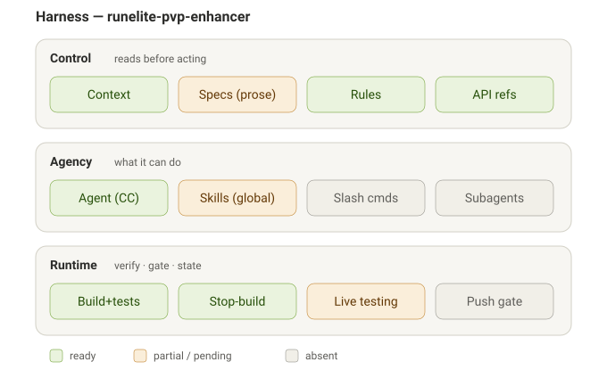

# The harness environment

Harness engineering designs the environment in which AI agents work, not just the prompts. Core principle: an agent produces better code when the environment guides it before it acts and verifies it after.

Two movements:

- **Feedforward guides** — what you tell the agent beforehand (context, rules, specification).
- **Feedback sensors** — what catches errors afterward (build/test gates, live validation, history).

## Overview

Green = ready; amber = partial or pending; gray = absent. The three layers are the CAR decomposition, described below. This diagram stays in sync with the actual harness state.

## Three layers (CAR decomposition)

- **Control** — what the agent reads before acting: project state, code rules, specifications, API references.
- **Agency** — what the agent can do: tools, commands, skills, subagents.
- **Runtime** — verification and state: build/test gates, live validation, history, checkpoints.

This is a **prose-spec, single-agent** harness, not a multi-agent / formal-spec one. The specification lives as human-readable docs (PROJECT.md, the backlog, the design docs), and integrity is held by a read-order protocol and a per-turn build gate rather than by spec-reviewer subagents or a machine-validated spec format. That fits a solo RuneLite plugin where most behaviour can only be confirmed live, in-game.

## Project components

### Control (read before acting)

- `CLAUDE.md` — the workspace index. **Read first.** Strict key-value: project facts, the AI protocol (the read order, the per-session bookkeeping rule, the doc 3-tier rule, the human-testing rule), communication style (caveman-lite for chat + Tier-1 docs), and the file map.
- `CONTEXT.md` — live project state. **Read second.** The current-focus narrative (re-baselined each session), open threads, known issues, and a long list of hard-won API gotchas ("do not relearn").
- `PROJECT.md` — mission, scope, and architecture constraints. **Read before any code task** touching plugin structure, overlays, or game interaction. This is the closest thing to a spec.
- `.ai/backlog.md` + `.ai/backlog-history.md` — the product backlog (OPEN items only, priority-ordered) and the archive of accepted work. The "spec" of what to build next, in prose.
- `.ai/rules/` — rule files loaded on demand by `load_when` match (`doc-style.md` = the 3-tier doc classification; `CONTEXT.md` = root rule context). Priority: explicit `load_when` > package CONTEXT.md > root CONTEXT.md > architecture.
- `.ai/architecture.md` + per-package `CONTEXT.md` — the real component map (plugin → services → overlays → models) and per-directory context.
- `.ai/game/` + `docs/` — curated RuneLite/OSRS-PvP API references and design docs / spikes (consulted before web search), e.g. `docs/fixed-resizable-layout.md`, `docs/overhead-resize-spike.md`, `docs/pid-indicator-spike.md`.

### Agency (what it can do)

- **Claude Code and its tools** — read/edit/write, shell (Gradle, git, `gh`), search.
- **Global skills** consulted opportunistically — `grill-me` (used to resolve uncertain designs before building, e.g. the fixed-layout camera), plus the platform skill set. None are project-specific.
- **No project-specific slash commands** and **no custom subagents** — this is a single-agent harness; specialization is provided by the read-order protocol and the rule files, not by role-specialized agents.

### Runtime (verification, gate, state)

- `./gradlew build` — the gate: compile + the full unit suite (82 tests). Pure logic (combat math, combo detection, gear value, heal math) is unit-tested without a live client.
- **Stop-hook auto clean-build** (`.claude/settings.local.json` → `scripts/clean-build.sh`) — runs after every turn (async) and re-wakes the agent if the build breaks, so a regression is caught immediately rather than at push time.
- `.ai/human-testing.md` + `.ai/human-testing-history.md` — the **live-validation loop**, which is to live testing what the backlog is to development. Overlay rendering, in-game feel, projection/camera behaviour, and weapon-speed/offset accuracy can only be confirmed by a human in a real OSRS client; HT-NNN items queue those checks, the agent guides them one step at a time, and PASS/FAIL feeds back into the backlog. This is the dominant feedback sensor for a plugin whose effects are visual and in-combat.
- **Session history + checkpoints** — `.ai/sessions/SXXX_*.md` (one per session, loaded in isolation), the re-baselined `CONTEXT.md`, and git history are the trace of decisions.

## Current state

Control and Runtime are the strong layers. The read-order protocol, the prose specs (PROJECT.md + backlog + design docs), the rule files, and the API-gotcha log are all live; the per-turn Stop-hook build gate + the 82-test suite keep the code green continuously; the human-testing queue carries everything that needs a live client.

Agency is deliberately thin: one agent with general tools plus global skills. There are no project subagents, no `/opsx`-style commands, and no formal machine-validated spec — integrity is held by process (the read order, the per-session bookkeeping, the human-testing gate) rather than by tooling.

Pending / absent: a **pre-push git gate** (secret scan + build) — today the gate is the Stop-hook build only, and commits/pushes are manual; **static analysis / secret scanning** (no SAST or dependency scan); and **a formal spec layer** (the spec is prose, not validated). These are gray on the diagram. The largest standing feedback gap is inherent: most PvP behaviour is live-only, so the human-testing loop, not CI, is the real verifier.

---

_This document and `harness-status.svg` stay in sync with the actual harness. When you evolve the environment, update both._
